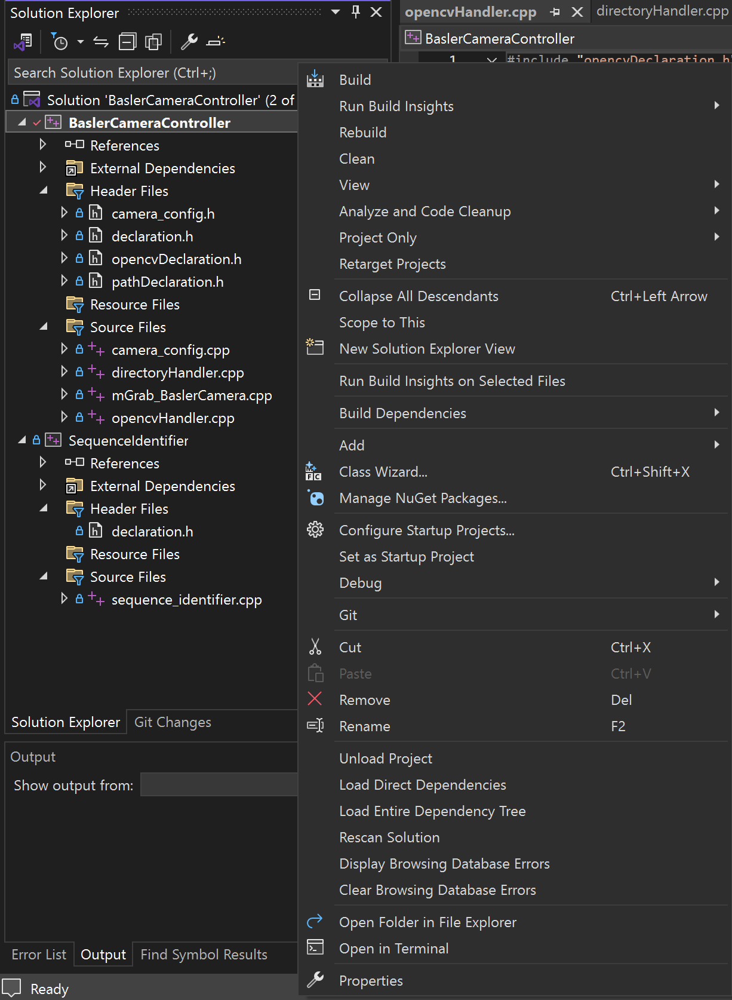
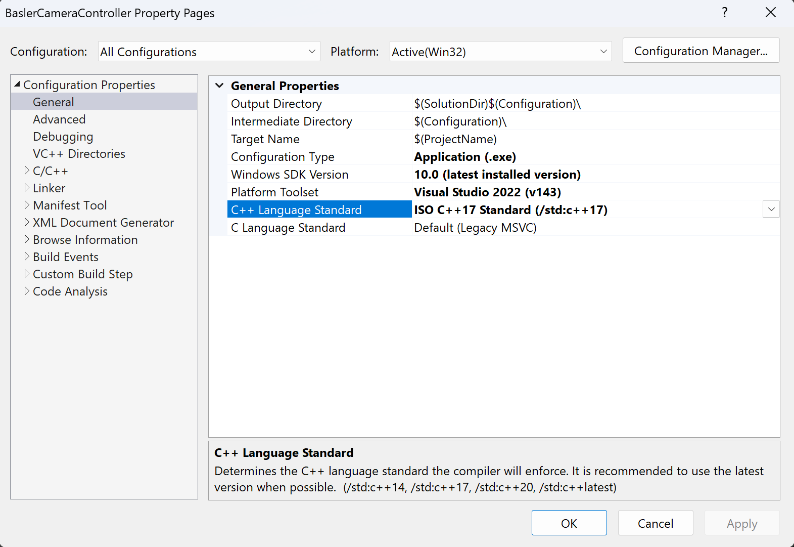
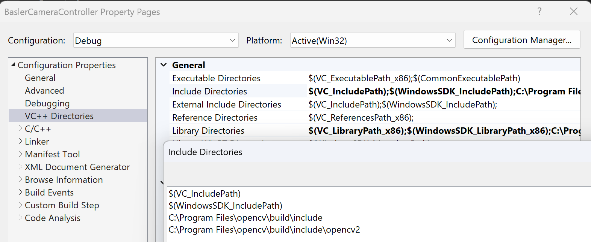
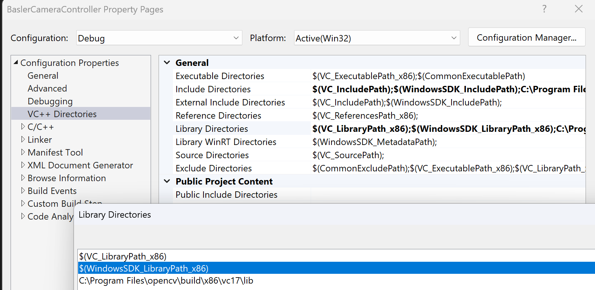
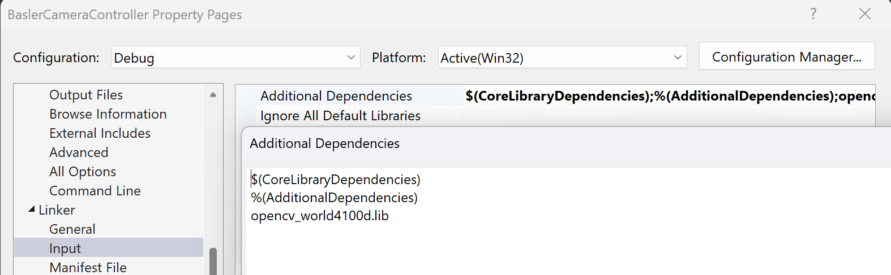
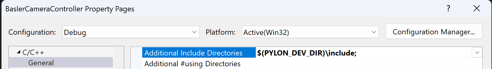
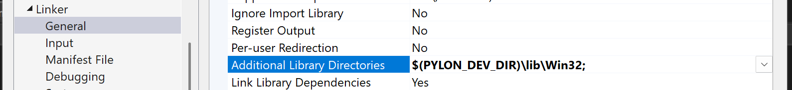

# BaslerCameraController
宝视纳相机控制软件，根据Pylon API给出的[官方示例和编程文档](https://docs.baslerweb.com/pylonapi/cpp/)而来，旨在简化相机的调用代码  
Github上似乎不能显示图片，请克隆到本地以查看图片配置教程

## 使用之前
1. [安装Visual Studio](https://visualstudio.microsoft.com/zh-hans/)运行本项目，使用Visual Studio Codes可能会使得项目配置过程变得异常复杂。
2. 安装opencv，且在运行设备上[构建opencv（32位）库](https://aidenlin.github.io/2019/12/01/Compile-the-opencv-to-32bit/)。构建opencv32位库是一个十分复杂的过程，大约需要两个小时左右。
3. [下载Pylon Viewer](https://www.baslerweb.com/en/downloads/software/2012599532/?downloadCategory.values.label.data=pylon)。该软件包括了相机数据可视化软件，在实验过程中必不可少，同时也配备了本项目必须的Pylon API。

## 在Visual Studio中配置本项目
1. 打开`BaslerCameraController.sln`
2. 更改项目属性：`BaslerCameraController -> Properties`

3. 配置属性中注意设置运行配置`Configuration: All Configurations`以及运行平台`Platform: Win32`，接下来`Configuration Properties -> General`设置C++语言标准`C++ Language Standard: ISO C++17 Standard (/std:c++17)`

4. 配置opencv(32位)库，以下配置方法参考自[此处](https://blog.csdn.net/didi_ya/article/details/113354599)
    1. 设置opencv包含目录`VC++ Directories -> Include Directories`，添加: **C:\your opencv dir\build\include**以及**C:\your opencv dir\build\include\opencv2**
    2. 设置opencv库目录`VC++ Directories -> Library Directories`，添加：**C:\your opencv dir\build\x86\vc__\lib**，下划线部分vc版本可能会不同
    3. 设置opencv链接文件`Linker -> Input -> Additional Dependencies`，添加：**opencv_world4100d.lib**。该文件的数字部分可能会根据版本有所不同
5. 配置pylon环境，以下配置方法参考自[此处](https://docs.baslerweb.com/pylonapi/cpp/)
    1. 设置pylon包含目录`C/C++ -> General -> Additional Include Directories`，添加：**$(PYLON_DEV_DIR)\include;**
    2. 设置pylon库依赖`Linker -> General -> Additional Library Dependencies`，添加：**$(PYLON_DEV_DIR)\lib\Win32;**

请移步以查看相机控制器的[使用说明](./BaslerCameraController/README.md)。如果成功调用相机，请使用`SequenceIdentifier`项目来验证结果的可用性，使用说明[在此处](./SequenceIdentifier/README.md)。